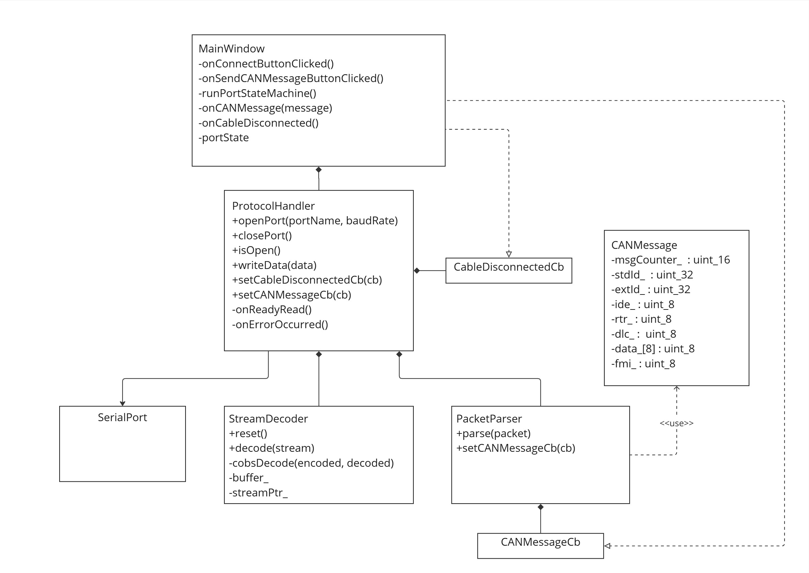

# OBD Scanner

## Table of Contents

[1. Functionalities](#1-functionalities)

[2. SW Architecture](#2-sw-architecture)

[3. SW Units](#3-sw-units)

&nbsp;&nbsp;[3.1 Main Window](#31-main-window)

&nbsp;&nbsp;[3.2 Protocol Handler](#32-protocol-handler)

&nbsp;&nbsp;[3.3 Packet Parser](#33-packet-parser)

&nbsp;&nbsp;[3.4 Stream Decoder](#34-stream-decoder)

## 1. Functionalities

- Connects to a vehicle's OBD interface via a serial port.
- Receives and decodes CAN messages in real time.
- Displays CAN message data in a table format.
- Allows selection of serial port and baud rate.
- Handles cable disconnection events.

## 2. SW Architecture

The application is structured around a Qt GUI, with modular components for protocol handling, packet parsing, and stream decoding. The main window manages user interaction and displays data, while background components handle serial communication and data processing.

  

## 3. SW Units

### 3.1 Main Window

- Implemented in [`MainWindow.cpp`](src/MainWindow.cpp) and [`MainWindow.h`](src/MainWindow.h).
- Provides the main user interface, including controls for connecting/disconnecting, selecting ports and baud rates, and displaying CAN messages.
- Handles callbacks for incoming CAN messages and cable disconnection.
- Manages the port state machine (IDLE, ACTIVATED, DEACTIVATED).

### 3.2 Protocol Handler

- Implemented in [`ProtocolHandler.cpp`](src/ProtocolHandler.cpp) and [`ProtocolHandler.hpp`](src/ProtocolHandler.hpp).
- Manages the serial port connection using Qt's `QSerialPort`.
- Provides methods to open, close, and check the status of the serial port.
- Handles reading incoming data from the serial port and writing outgoing data.
- Integrates the [`StreamDecoder`](src/StreamDecoder.cpp) to decode incoming byte streams and the [`PacketParser`](src/PacketParser.cpp) to parse CAN messages.
- Supports registering callbacks for:
  - New CAN messages (invoked when a valid CAN message is parsed).
  - Cable disconnection events (invoked on serial port resource errors).
- Handles serial port errors and triggers the cable disconnection callback when necessary.

### 3.3 Packet Parser

- Implemented in [`PacketParser.cpp`](src/PacketParser.cpp) and [`PacketParser.hpp`](src/PacketParser.hpp).
- Responsible for parsing raw CAN message packets into structured [`CANMessage`](src/PacketParser.hpp) objects.
- Invokes a callback when a new CAN message is parsed.

### 3.4 Stream Decoder

- Implemented in [`StreamDecoder.cpp`](src/StreamDecoder.cpp) and [`StreamDecoder.hpp`](src/StreamDecoder.hpp).
- Decodes incoming byte streams using COBS (Consistent Overhead Byte Stuffing) framing.
- Provides a stateful decode interface, returning completed, ongoing, or error states.
- Used by the protocol handler to extract complete packets from the serial stream.
